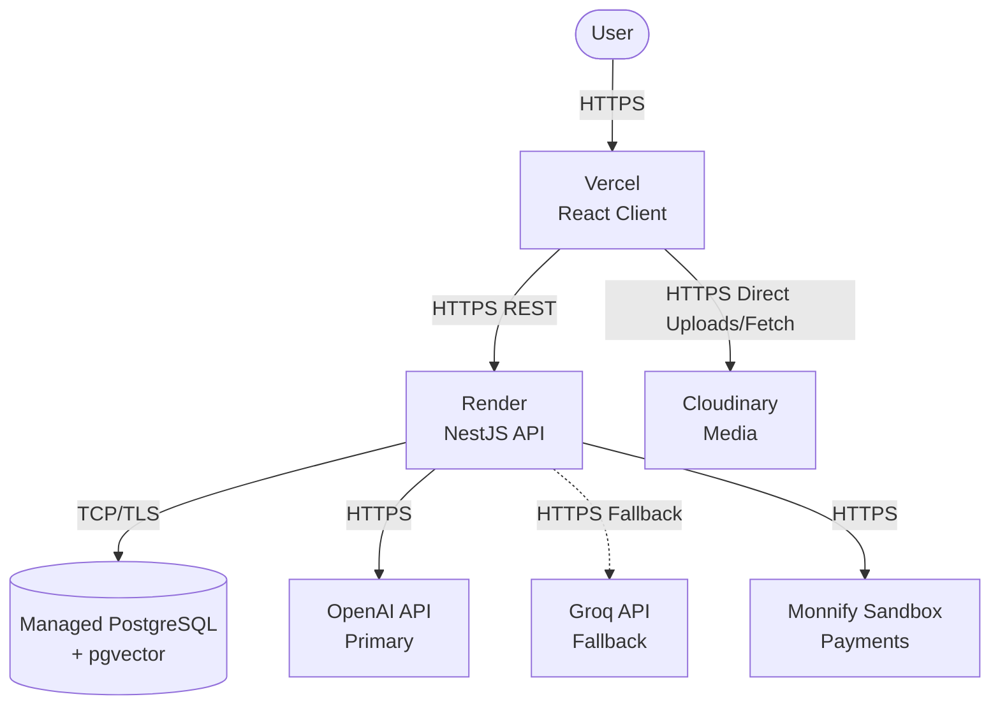

# BambiFound System Design

## 1. Executive Summary
This document defines the technical architecture for the BambiFound MVP. The objective is to establish a pragmatic, production-ready system design that prioritizes development speed, low operational overhead, and maintainability without over-engineering. It outlines the transition from local development to a distributed, cloud-native deployment model utilizing Vercel, Render, managed PostgreSQL, and external AI and media providers.

## 2. Product Context
**Product Name:** BambiFound
**Positioning:** "Find the people who help you build."
**Description:** An AI-powered startup ecosystem designed to help founders, startups, and talent find the people and opportunities needed to build and grow.
**Core MVP Direction:** Find → Match → Connect → Build.
**Exclusions:** Investor functionality is explicitly excluded from the initial MVP.

## 3. Architectural Principles
*   **Ship Fast:** Prioritize MVP delivery over theoretical future scaling requirements.
*   **Keep it Clean:** Enforce strict separation of concerns between client, API, and third-party services.
*   **Practical Deployments:** Use familiar, managed PaaS solutions (Vercel, Render) with robust free tiers to minimize DevOps overhead.
*   **Avoid Unnecessary Infrastructure:** Exclude Redis, MongoDB, dedicated vector databases, or complex messaging queues from the MVP unless explicitly required by a feature.

## 4. Repository Architecture
The project utilizes a single Git repository containing two independently deployable applications. This avoids complex monorepo tooling while keeping the codebase unified.

```text
bambifound/
├── client/                 # React + Vite frontend
│   ├── package.json
│   ├── src/
│   └── public/
├── server/                 # NestJS REST API
│   ├── package.json
│   ├── src/
│   └── prisma/
├── docs/                   # Documentation and ADRs
├── docker-compose.yml      # Local development infrastructure
├── README.md
├── .gitignore
└── .env.example
```
*The `client` and `server` share a repository but have no deployment dependencies on each other.*

## 5. High-Level System Architecture
The request flow and component interaction:



## 6. Frontend Architecture
**Tech Stack:** React, Vite, TypeScript, Tailwind CSS, shadcn/ui, TanStack Query, React Hook Form, Zod.
**Architecture:**
*   **Routing:** React Router (or equivalent) for client-side navigation.
*   **Server State:** TanStack Query for data fetching, caching, synchronization, and invalidation.
*   **Form State & Validation:** React Hook Form bound with Zod schemas matching backend constraints.
*   **UI Components:** shadcn/ui customized with Tailwind CSS, adhering strictly to the Google Stitch designs.
*   **Missing Screens:** Development is strictly limited to approved Stitch designs. Unapproved screens are deferred to `docs/design/design-gap-backlog.md`.

## 7. Backend Architecture
**Tech Stack:** NestJS, TypeScript, REST, Prisma.
**Architecture:**
*   **Modules:** Authentication, Users, Profiles, Intents, Startups, Opportunities, Discovery, Connections, Messaging, AI, Media. (Payments deferred to later MVP stages).
*   **Domain Boundaries:** Strict encapsulation. The API layer (Controllers) handles HTTP, Services handle business logic, and Repositories/Prisma handle data access.

## 8. Database Architecture
**Tech Stack:** PostgreSQL + pgvector (via Prisma).
**Conceptual Entities:**
*   **User:** Core identity and authentication.
*   **Profile:** Personal details, skills, and experience. Belongs to User.
*   **Intent:** The user's current goals (e.g., Finding co-founder, Hiring). Many-to-Many with User.
*   **Startup:** Company representation. Owned by User (1 free per user).
*   **Opportunity:** Roles or needs posted by a Startup.
*   **Match:** Records compatibility evaluations and explanations.
*   **Connection:** State of networking links between Users.
*   **Message:** Direct communication records.

*Note: Migrations will be generated iteratively. Schema evolution will follow implementation steps.*

## 9. Authentication Architecture
*   **Strategy:** Stateless JWT access tokens + stateful/rotatable refresh tokens.
*   **Storage:** Refresh tokens stored in secure, HttpOnly, SameSite cookies to mitigate XSS. Access tokens stored in memory by the client.
*   **Hashing:** Argon2id for robust password security.
*   **Flow:** Login issues both tokens. Access token expires quickly (e.g., 15m). Client uses refresh token endpoint to obtain a new access token seamlessly.

## 10. AI Architecture
Business logic is decoupled from specific SDKs via an internal Abstraction Interface.
```text
Application Logic -> AIService Interface -> [OpenAI Adapter (Primary) | Groq Adapter (Fallback)]
```
*   **Capabilities:** Profile extraction, semantic embeddings generation, match explanations.
*   **Resilience:** If OpenAI fails, the system seamlessly falls back to Groq. Model names are passed via environment variables, not hardcoded.

## 11. Matching Architecture
A hybrid pipeline, preventing AI from silently making consequential rejections.
1.  **Hard Filters:** (e.g., location constraints, strict availability).
2.  **Structured Scoring:** Database-level queries on defined skills/intents.
3.  **Semantic Similarity:** `pgvector` nearest-neighbor search using AI-generated embeddings.
4.  **Ranking:** Composite score compilation.
5.  **Explanation:** Generative AI prompt summarizing *why* the match was made based on visible, shared attributes.

## 12. Intent Architecture
Users are not locked into singular roles. An `Intent` model allows multiple concurrent objectives:
*   Building a startup
*   Looking for a co-founder
*   Looking for talent
*   Looking for opportunities/jobs
(Investor intent excluded from MVP).

## 13. Startup Architecture
*   **MVP Rule:** Every registered user can create exactly ONE startup for free.
*   **Future-proofing:** The data model allows `User 1:N Startups` to support future paid "Venture Studio" tiers without architectural rewrites. Pricing logic is currently excluded.

## 14. Media Architecture
*   **Provider:** Cloudinary.
*   **Flow:** Client uploads directly to Cloudinary (using signed URLs generated by the backend) or backend handles lightweight proxying. 
*   **Storage:** PostgreSQL stores only the Cloudinary URLs/public IDs, keeping the database lean.

## 15. Payment Architecture
*   **Provider:** Monnify Sandbox (Development/Testing).
*   **Flow:** Webhook-based asynchronous verification. NestJS initiates payment -> Monnify Sandbox -> NestJS Webhook verifies -> Database records entitlement.
*   **Status:** Not a prerequisite for initial MVP launch. Built defensively to allow future live integrations.

## 16. API Architecture
*   **Style:** REST over HTTPS.
*   **Documentation:** Swagger / OpenAPI auto-generated via NestJS.
*   **Conventions:** Standard HTTP verbs, predictable resource-oriented URLs (e.g., `/api/v1/startups/:id/opportunities`), consistent JSON error wrapping, and pagination cursors/offsets for collections.

## 17. Security Architecture
*   **Data:** Prisma prevents SQL injection. Zod validates all API inputs.
*   **Auth:** Argon2id hashing, HttpOnly cookies for refresh tokens.
*   **Network:** Explicit CORS configuration (no wildcards). Rate limiting applied to auth and AI endpoints.
*   **Secrets:** Managed exclusively via `.env` files locally and PaaS secrets management in production.

## 18. Environment Configuration
Variables are strictly segregated by environment.
*Example `.env` schema:*
*   `DATABASE_URL` (Connection string)
*   `JWT_SECRET` / `JWT_REFRESH_SECRET`
*   `OPENAI_API_KEY` / `GROQ_API_KEY`
*   `AI_MODEL_PRIMARY` / `AI_MODEL_FALLBACK`
*   `CLOUDINARY_URL`
*   `FRONTEND_ORIGIN` (For CORS)

## 19. Deployment Architecture
*   **Client:** GitHub -> Vercel (Automated CI/CD deployments on push to `main`).
*   **Server:** GitHub -> Render (Web Service, auto-deployed).
*   **Database:** Neon (Serverless PostgreSQL).
*   **Services:** Cloudinary, Monnify, OpenAI, Groq.

## 20. Local vs Production Architecture

| Component | Local Development | Production | Rationale for Difference |
| :--- | :--- | :--- | :--- |
| **Frontend** | `localhost:3000` (Vite dev server) | Vercel Edge Network | Vercel provides global CDN and SSL. |
| **Backend** | `localhost:4000` (Nest dev server) | Render Web Service | Render provides managed container execution and SSL. |
| **Database** | Docker (PostgreSQL + pgvector) | Neon Managed PostgreSQL | Docker is free and isolated locally; Neon provides managed backups and scaling. |
| **Media** | Local Mock / Cloudinary Dev env | Cloudinary | Simplifies local dev without requiring internet access for basic tests. |
| **AI** | OpenAI / Groq | OpenAI / Groq | Same providers used to guarantee parity in AI behavior. |
| **Redis** | None | None | Excluded from MVP to reduce complexity. |

## 21. Testing Architecture
*   **Client:** Vitest for utility functions, React Testing Library for component rendering, Playwright for critical E2E flows (e.g., Registration).
*   **Server:** NestJS Unit tests for services, Supertest for API integration tests.
*   **AI:** Deterministic mock implementations of the `AIService` interface for CI pipelines to prevent incurring API costs and ensure test stability.

## 22. Observability
*   **Logging:** NestJS structured JSON logger (e.g., `pino`).
*   **Health:** `/api/health` endpoint verifying DB and external service connectivity.
*   **Error Tracking:** Basic Render/Vercel logs for MVP. Advanced APM (e.g., Datadog, Sentry) deferred.

## 23. Architectural Non-Goals
*   Full investor marketplace or automated investment transactions.
*   Microservices or Kubernetes orchestration.
*   Dedicated VPS management.
*   Complex event-driven architectures (e.g., Kafka).
*   Mandatory Redis caching/queues.
*   Dedicated vector databases (e.g., Pinecone, Qdrant) outside of PostgreSQL.

## 24. Technology Decision Record (ADR Summary)

| Decision | Selection | Rationale | Trade-off |
| :--- | :--- | :--- | :--- |
| **Repo Structure** | Single Repo / 2 Folders | Keeps code together without the overhead of pnpm workspaces/monorepo tooling. | Less native code sharing (types must be duplicated or synced). |
| **DB Provider** | Neon | Serverless Postgres, scale-to-zero (cheap MVP), native branching, and excellent Prisma/pgvector support. | Vendor lock-in to serverless paradigm vs traditional RDS. |
| **Frontend Host** | Vercel | Zero-config deployment for React/Vite, excellent developer experience. | Limited backend compute capabilities (hence Render). |
| **Backend Host** | Render | Native Node/NestJS support, predictable pricing, avoids serverless cold starts for complex Nest applications. | Slightly more configuration required than Vercel serverless functions. |
| **Vector Search**| pgvector | Keeps relational data and embeddings in the same database, eliminating synchronization logic. | Scaling vectors eventually requires vertical DB scaling rather than specialized DB scaling. |
| **Media** | Cloudinary | Developer familiarity, excellent on-the-fly transformations, avoids managing local MinIO in production. | Third-party dependency for all images. |
| **Redis** | Excluded | MVP does not have traffic requiring caching or complex background jobs yet. | Synchronous processing of heavy tasks (like AI calls) might slow down HTTP responses temporarily. |

## 25. Risks / Trade-offs
*   **Type Sharing:** Without a strict monorepo tool (like Turborepo/pnpm workspaces), sharing TypeScript interfaces between `client` and `server` requires manual synchronization or a lightweight sync script.
*   **Synchronous AI:** Without BullMQ/Redis, API requests that trigger AI processing will block the HTTP response. If AI response times spike, request timeouts may occur.

## 26. Future Extension Points
*   **Redis + BullMQ:** Can be seamlessly introduced into NestJS later to offload AI embedding generation and email sending to background workers.
*   **Paid Tiers:** The `User 1:N Startup` database structure easily accommodates a future subscription module.
*   **Mobile App:** The strict REST API design allows a future React Native app to consume the exact same endpoints as the web client.
