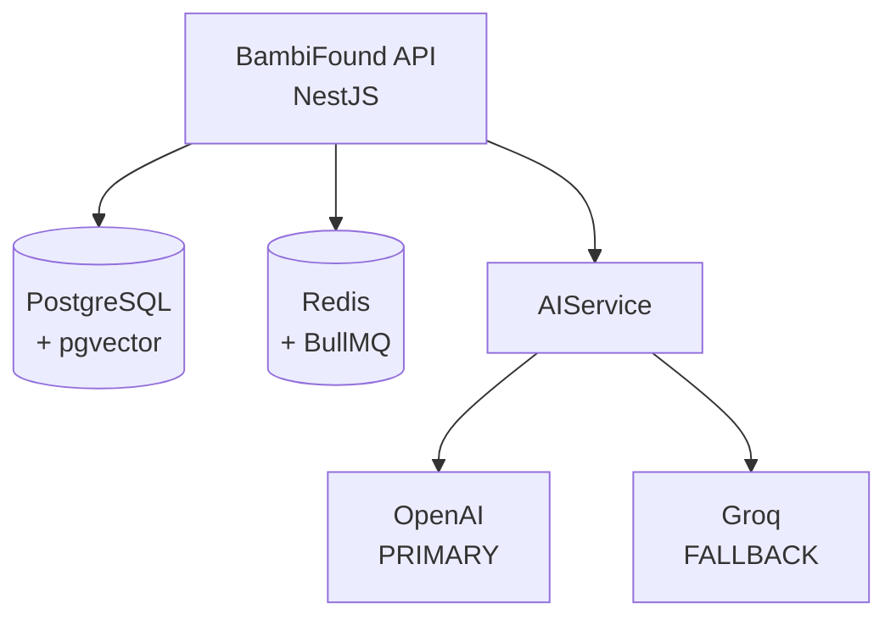
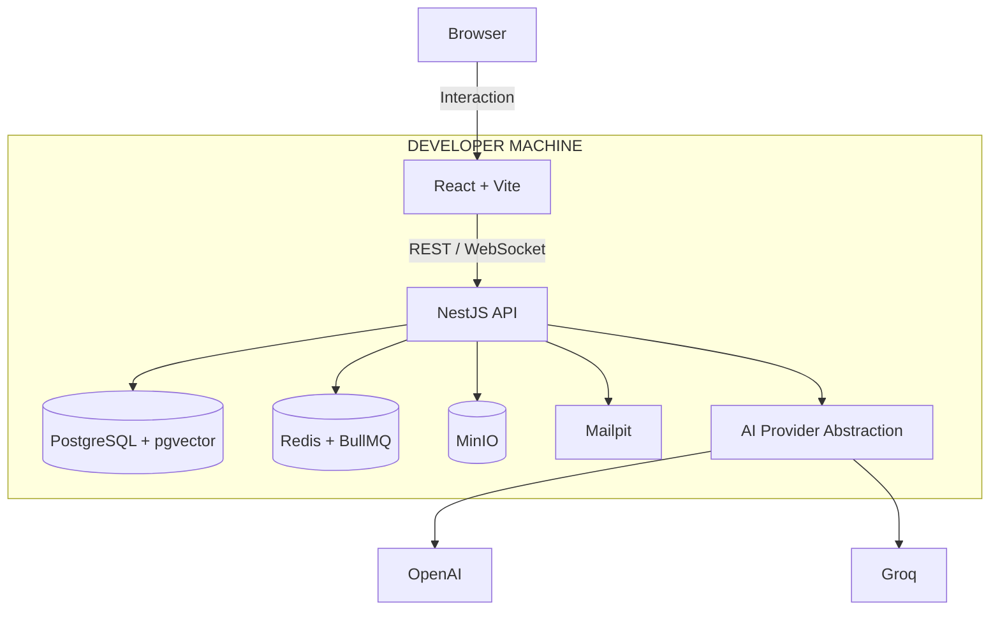

# BambiFound System Design

## Overview
This document outlines the system architecture and locked technical decisions for the BambiFound platform. The architecture is designed for a reproducible local development environment that closely resembles the eventual production deployment.

## Locked Architectural Decisions

| Area | Decision |
| :--- | :--- |
| **Language** | TypeScript |
| **Repository** | TypeScript monorepo |
| **Package manager** | pnpm |
| **Frontend** | React + Vite |
| **UI** | Tailwind CSS + shadcn/ui |
| **Backend** | NestJS |
| **API** | REST |
| **API documentation** | OpenAPI/Swagger |
| **Validation** | Zod at application boundaries + Nest validation |
| **Server state** | TanStack Query |
| **Forms** | React Hook Form + Zod |
| **ORM** | Prisma |
| **Database** | PostgreSQL |
| **Vector search** | pgvector on PostgreSQL |
| **Primary AI provider** | OpenAI API |
| **Fallback AI provider** | Groq API |
| **AI abstraction** | Provider interface + OpenAI/Groq adapters |
| **Auth** | JWT access + refresh-token architecture |
| **Password hashing** | Argon2id |
| **Realtime** | WebSockets via Socket.IO |
| **Background jobs** | BullMQ |
| **Queue/cache** | Redis |
| **File storage** | S3-compatible object storage abstraction; local MinIO |
| **Email** | Local Mailpit; provider abstraction for production |
| **Local infrastructure** | Docker Compose |
| **Frontend hosting** | Vercel |
| **CI/CD** | GitHub Actions |
| **Testing** | Vitest + React Testing Library + Supertest + Playwright |
| **Logging** | Structured JSON logging |
| **Observability** | OpenTelemetry-compatible architecture (full prod observability deferred) |

### Key Architectural Rationale

*   **NestJS + TypeScript**: Provides a structured backend architecture that fits the growing domain model better than a minimally structured Express application.
*   **Prisma + PostgreSQL**: Offers strong TypeScript integration and a clean relational model for Users, Profiles, Intents, Startups, Opportunities, Matches, Connections, and Messages.
*   **pgvector**: Semantic matching lives alongside relational data, avoiding the need for a separate vector database for the MVP and reducing infrastructure complexity.
*   **AI Abstraction**: The OpenAI → Groq fallback is implemented behind an internal AI provider interface. Groq provides an OpenAI-compatible API surface. **Crucially, AI providers must not leak into business logic.** The application should use generic calls like `AIService.generateProfileSummary(...)` rather than provider-specific calls. Structured output should rely on Zod-based schemas.

## Architecture Diagrams

### Backend AI Architecture

### Local Development Environment

## Open Decisions (Deferred)

The following decisions are deliberately left open to be resolved before production deployment or during environment setup:

*   **Backend production host** — [OPEN]
*   **Production object-storage provider** — [OPEN]
*   **Production email provider** — [OPEN]
*   **Exact PostgreSQL version** — (To be selected during environment setup)
*   **Exact OpenAI/Groq model IDs** — (Should be configuration, not architecture)

## Local Setup Summary

The local environment is fully reproducible using:
`pnpm` + `Docker Compose` + `PostgreSQL/pgvector` + `Redis` + `MinIO` + `Mailpit`

OpenAI and Groq remain external AI services accessed exclusively through the backend to keep API keys off the browser and ensure the local environment mirrors production.
